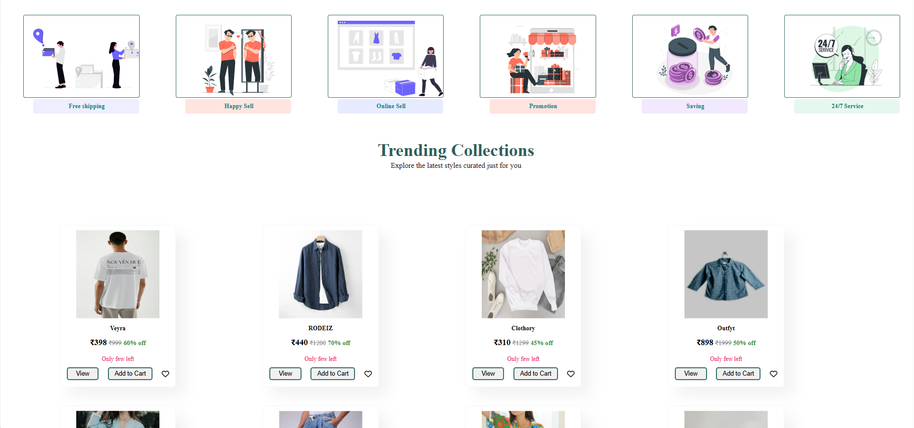
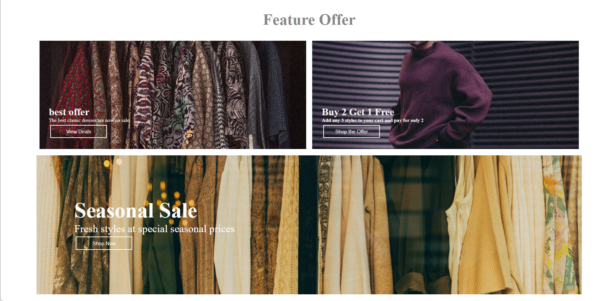
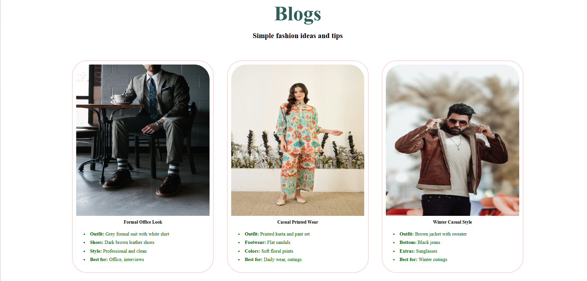
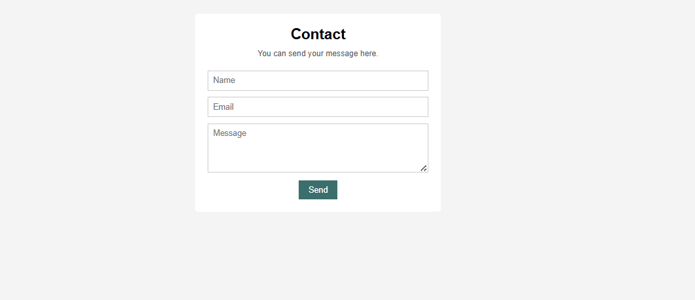
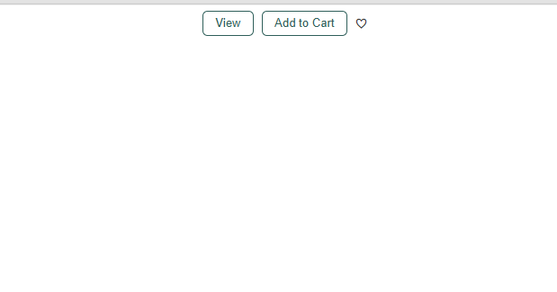

# 🛍️ Stylera — Shopping Platform

A modern, responsive e-commerce front-end website built with pure HTML, CSS, and JavaScript.

---


## 📸 Preview

### 🏠 Home Page


### 🛍️ Products


### 🎯 Feature Offers


### 🦶 Footer


### 📰 Blog


### 📞 Contact


### 🛒 Add to Cart


---

## ✨ Features

- 🏠 **Home Page** — Hero section with smooth scroll to collections
- 🛒 **Product Collection** — 12+ products with price, MRP, and discount display
- ❤️ **Wishlist Toggle** — Click heart icon to add/remove from wishlist
- 🛍️ **Add to Cart** — Alerts on adding product to cart
- 👁️ **View Product** — Shows price details on click
- 🎯 **Best Offer Filter** — Filters products with 60%+ discount
- 📢 **Welcome Popup** — Login popup shown once per session using `sessionStorage`
- 📰 **Blog Page** — Fashion blog section
- 📦 **Feature Highlights** — Free Shipping, Happy Sell, Online Sell, Promotion, Saving, 24/7 Service
- 📱 **Responsive Design** — Mobile friendly with media queries
- 🦶 **Footer** — Links, social media, and branding

---

## 🗂️ Project Structure

```
Stylera/
├── index.html          # Home page
├── shop.html           # Shop page
├── blog.html           # Blog page
├── cart.html           # Cart page
├── contact.html        # Contact page
├── assets/
│   ├── css/
│   │   ├── style.css       # Main stylesheet
│   │   ├── shop.css
│   │   ├── blog.css
│   │   ├── cart.css
│   │   └── contact.css
│   ├── js/
│   │   └── script.js       # All JavaScript logic
│   └── images/             # All images and SVG icons
```

---

## 🛠️ Tech Stack

| Technology | Usage |
|---|---|
| HTML5 | Structure & Markup |
| CSS3 | Styling, Flexbox, Grid, Media Queries |
| JavaScript (Vanilla) | DOM manipulation, Events, sessionStorage |
| Font Awesome 6 | Icons |

---

## 🚀 Getting Started

### Clone the repository

```bash
git clone https://github.com/Atharv122005/Stylera-shopping-platform.git
cd Stylera-shopping-platform
```

### Run locally

Just open `index.html` in your browser — no build tools or dependencies needed!

---

## 📲 Deployment

### GitHub Pages

1. Go to your repository on GitHub
2. Click **Settings** → **Pages**
3. Under **Source**, select `main` branch → `/ (root)`
4. Click **Save**
5. Your site will be live at `https://Atharv122005.github.io/Stylera-shopping-platform/`

---

## 📋 Pages Overview

| Page | Description |
|---|---|
| `index.html` | Landing page with hero, features, products, banners |
| `shop.html` | Full product listing / shop page |
| `blog.html` | Fashion blog with articles |
| `cart.html` | Shopping cart page |
| `contact.html` | Contact form page |

---

## 🙌 Acknowledgements

- Design inspired by modern Indian fashion e-commerce platforms
- Icons from [Font Awesome](https://fontawesome.com/)
- Project built as part of learning front-end web development

---

> Made with ❤️ by **Atharv**
